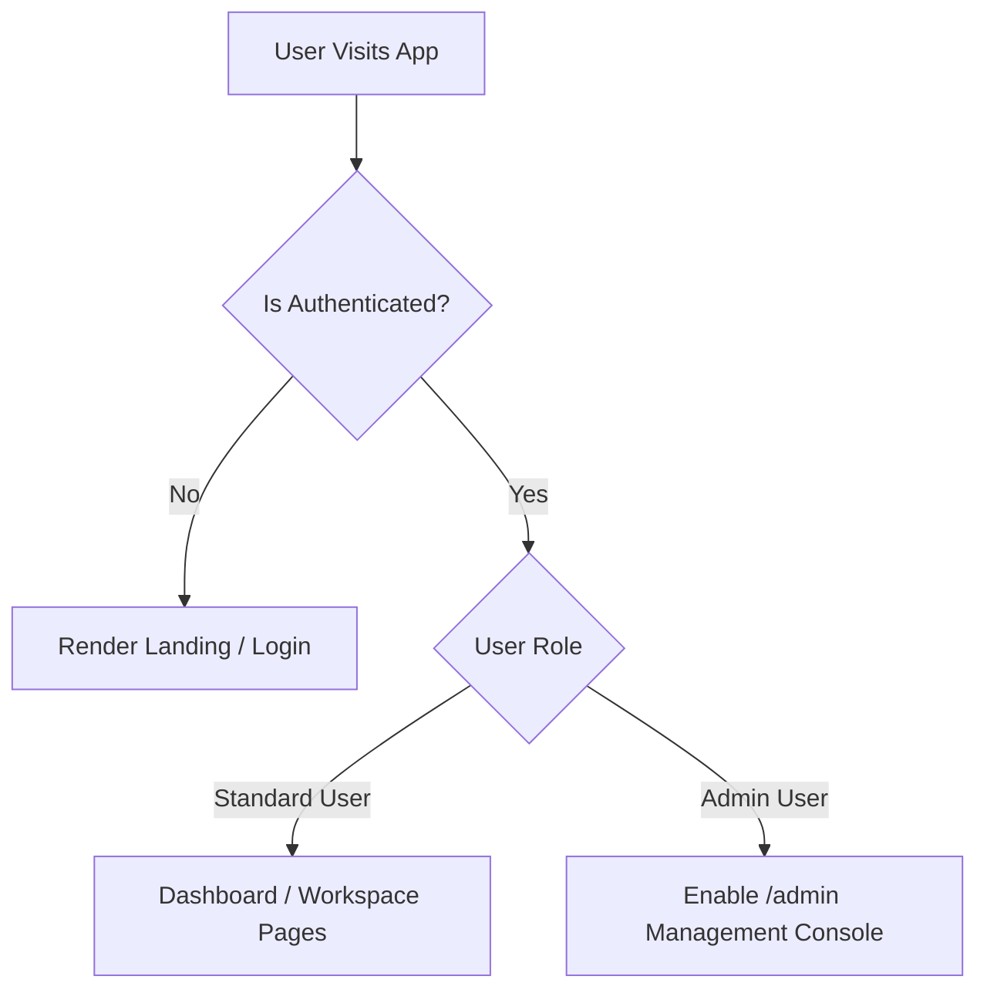

# QuizMind Client Portal

This directory contains the standalone React single-page web application (SPA) that acts as the user interface for the QuizMind ecosystem. It features rich visual aesthetics, micro-animations, structured routes, and real-time state synchronization with the FastAPI backend.

---

## 1. Technology Stack & Key Libraries

The frontend is built upon a modern, high-performance web development stack:
- **Core Framework**: [React 19](https://react.dev/) + [TypeScript](https://www.typescriptlang.org/) for component modularity and type safety.
- **Build Tooling**: [Vite](https://vite.dev/) for extremely fast Hot Module Replacement (HMR) and compilation.
- **Styling Engine**: [Tailwind CSS v4](https://tailwindcss.com/) (`@tailwindcss/vite` plugin integration) for atomic styling.
- **State Management**: [Zustand](https://github.com/pmndrs/zustand) for lean, high-speed, and non-boilerplate global application states.
- **Data Fetching**: [TanStack React Query v5](https://tanstack.com/query/latest) for declarative network state synchronization, query caching, and request de-duplication.
- **HTTP client**: [Axios](https://axios-http.com/) configured with standard cookie credentials (`withCredentials = true`) to handle session storage automatically.

---

## 2. Application Architecture & Folder Structure

```
client/
├── public/                 # Static public assets
├── src/
│   ├── assets/             # Images, SVG icons, and custom logos
│   ├── components/         # Shared presentation elements (Layout, Navbar, etc.)
│   ├── lib/                # Shared utilities or standard helper configs
│   ├── store/              # Global state definition (useAppStore.ts)
│   ├── pages/              # Routed screen view components
│   ├── App.tsx             # Root routing and Query Client Provider setup
│   ├── main.tsx            # Application entry mounting point
│   ├── index.css           # Global custom styles and Tailwind entry point
│   └── App.css             # Page-specific styling rules
├── package.json            # Script commands and dependencies
├── vite.config.ts          # Vite compiler and development server options
└── tsconfig.json           # Global TypeScript parser configurations
```

---

## 3. Global State (Zustand Store)

State management is consolidated within the `useAppStore.ts` store.

> [!NOTE]
> **Authentication Credentials Ingestion**: In QuizMind, user session authentication relies on standard cookies managed directly by FastAPI. The frontend Zustand store communicates via credentials-enabled Axios requests to automatically persist session data without needing local storage tokens.

### Core States
- `user`: Holds the authenticated user object (`id`, `username`, `email`, `role`).
- `gamify`: Tracks live session parameters (`level`, `xp`, `streak`).
- `isLoggedIn` & `isLoading`: Controls application routing lifecycle states.
- `authConfig`: Houses SSO configuration specifications fetched on load from `/api/v1/auth/config`.

### Key Actions
- `fetchMe()`: Validates current session status by querying `/api/v1/auth/me`.
- `login(credentials)`: Submits credentials to the backend login router.
- `logout()`: Clears active sessions and redirects to the portal root directory.

---

## 4. Routing Architecture (`App.tsx`)

QuizMind uses declarative React Router setups, partitioning access based on roles and session status:



### Route Designations
1. **Public Routes**:
   - `/login` / `/auth/callback`: Handles standard and SSO login workflows.
   - `/`: Falls back to `<Landing />` if unauthenticated, or redirects to the dashboard if authenticated.

2. **Standard Protected Routes** (wrapped in unified dashboard navbar `<Layout />`):
   - `/profile`: View XP level badges and achievements.
   - `/stats`: Interactive history charts, correct answer ratios, and speed analysis.
   - `/manage`: Ingest spreadsheets, manage custom quizzes, or launch collaborative rooms.
   - `/manage/edit/:id`: Configure title, tags, description, instruction, and system AI prompts.
   - `/manage/edit/:id/questions`: Visual editor to add, update, or remove choices, answers, and audio paths.
   - `/room/join`: Enter code to enter live multiplayer game rooms.

3. **Fullscreen Protected Viewports**:
   - `/quiz/:id`: High-performance study screen detailing card count, metadata, and progress graphs.
   - `/quiz/:id/play`: Immersive, keyboard-controlled flashcard play interface supporting Spaced Repetition mastery loops.
   - `/room/:code`: Real-time WebSocket classroom quiz game lobby.

---

## 5. Development and Build Pipelines

### Run Frontend in Independent Dev Server
To start the React development server locally with live reload:
```bash
# In c:\Code\Ecosystem\QuizMind\client
npm install
npm run dev
```
*The dev server runs on `http://localhost:5173`. Any requests to `/api` or `/auth-center` are automatically proxied to the FastAPI server at `http://127.0.0.1:5080`.*

### Production compilation Pipeline
When deploying, the React application is built into single bundle assets:
```bash
npm run build
```
- **Vite output routing**: Configured in `vite.config.ts`, Vite compiles the production bundles and assets directly into the FastAPI static files directory (`../app/static/dist/`).
- **Dev-free running**: When executing the standalone backend launcher (`run_quizmind.py`), FastAPI serves these compiled static assets directly, meaning a separate Node process is not required in production.
