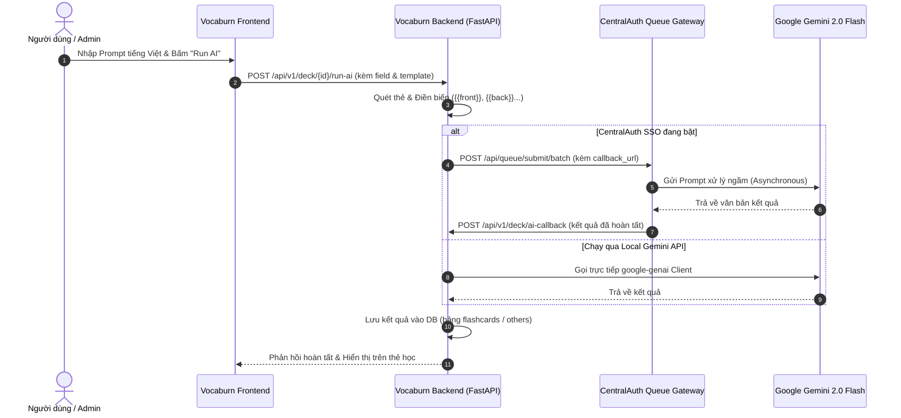

# 🤖 Hướng Dẫn Kỹ Thuật Viết Prompt Tiếng Việt Cho Vocaburn (AI Prompt Guide)

> **Tài liệu chuẩn hóa kiến tạo nội dung AI cho Vocaburn**  
> Áp dụng cho: Trợ lý AI giải thích thẻ (`AI Explain`), Sinh nội dung tự động hàng loạt (`Bulk AI Generation`), và Tùy biến cột dữ liệu học tập trong bộ thẻ (`Deck AI Settings`).

---

## 📌 1. Viết Prompt Bằng Tiếng Việt Được Không?

### ✅ HOÀN TOÀN ĐƯỢC VÀ RẤT KHUYẾN KHÍCH!
Dù giao diện ứng dụng Vocaburn tuân thủ quy tắc **English-Only UI** (để giữ tính quốc tế, gọn gàng và thẩm mỹ tối giản), việc **viết Prompt bằng tiếng Việt** cho mô hình AI mang lại những lợi ích vượt trội:

1. **Phù hợp bản địa hóa cho người học Việt Nam**:
   - Đối tượng người dùng chính của Vocaburn là người Việt đang học ngoại ngữ (Anh, Nhật, Hàn, Trung, Pháp...).
   - Viết câu lệnh (Prompt) bằng tiếng Việt giúp mô hình AI hiểu chính xác góc nhìn của người học Việt Nam: từ cách giải nghĩa tự nhiên, phân tích âm Hán - Việt, sự tương đồng ngữ pháp cho đến các lỗi sai người Việt hay mắc phải.
2. **Mô hình Gemini xử lý tiếng Việt xuất sắc**:
   - Vocaburn sử dụng các mô hình ngôn ngữ lớn tiên tiến (như `gemini-2.0-flash` qua CentralAuth hoặc trực tiếp).
   - Mô hình có khả năng hiểu tiếng Việt phong phú, trả về câu trả lời tự nhiên, giàu ngữ cảnh, văn phong sư phạm chuẩn mực và thân thiện.
3. **Mẹo ghi nhớ (Mnemonic) hiệu quả nhất bằng tiếng mẹ đẻ**:
   - Các kỹ thuật ghi nhớ như "bắc cầu âm thanh", chiết tự Hán Việt, hay câu chuyện liên tưởng chỉ thực sự phát huy tối đa hiệu quả khi được giải thích bằng tiếng Việt.

---

## 🧩 2. Danh Sách Các Biến Hệ Thống (Placeholder Variables)

Khi cấu hình Prompt trong **Deck Settings ➔ AI Prompts** hoặc gọi hàm sinh nội dung, hệ thống Vocaburn sẽ tự động quét và thay thế các biến sau bằng dữ liệu thực tế của từng thẻ:

| Biến Thay Thế | Dữ Liệu Tương Ứng | Ví Dụ Giá Trị |
| :--- | :--- | :--- |
| `{{front}}` hoặc `{{card}}` / `{{question}}` | Nội dung mặt trước thẻ (Từ vựng, mẫu câu, câu hỏi trắc nghiệm) | `食べる` hoặc `Ubiquitous` |
| `{{back}}` hoặc `{{explanation}}` | Nội dung mặt sau hiện tại (Nghĩa cơ bản, giải nghĩa sơ lược) | `Ăn` hoặc `Có mặt khắp nơi, phổ biến` |
| `{{correct_answer}}` | Đáp án đúng của thẻ (đối với câu hỏi trắc nghiệm hoặc bài tập) | `B. Ăn cơm` |
| `{{options}}` | Danh sách các phương án trả lời (nếu có) | `A. Uống, B. Ăn, C. Ngủ, D. Đi` |
| `{{deck_title}}` | Tiêu đề của bộ flashcard đang học | `N3 Tanki Master Từ Vựng` |
| `{{deck_description}}` | Mô tả khái quát của bộ flashcard | `Tổng hợp 500 từ vựng cốt lõi N3` |
| `{{global_instruction}}` | Chỉ dẫn chung của người tạo bộ thẻ | `Học kỹ ví dụ và sắc thái từ` |
| `` | Giá trị trong trường mở rộng (`others`) của thẻ | `{{kanji}}`, `{{furigana}}`, `{{collocation}}`... |

> [!TIP]
> Bạn có thể sử dụng cú pháp một ngoặc nhọn `{front}` hoặc hai ngoặc nhọn `{{front}}`, hệ thống Vocaburn đều hỗ trợ xử lý mượt mà.

---

## 📚 3. Thư Viện Prompt Tiếng Việt Chuẩn Mẫu (Sẵn Sàng Sử Dụng)

Dưới đây là bộ sưu tập các mẫu Prompt được tối ưu hóa đặc biệt cho thuật toán ghi nhớ giãn cách **FSRS v6**, giúp tối đa hóa khả năng lưu giữ thông tin dài hạn:

### Mẫu 1: Giải Thích Từ Vựng Toàn Diện (Khuyên Dùng Cho Cột `explanation`)
> **Mục đích**: Cung cấp bức tranh ngữ nghĩa hoàn chỉnh bao gồm từ loại, sắc thái sử dụng và câu ví dụ song ngữ.

```text
Bạn là chuyên gia ngôn ngữ học giàu kinh nghiệm. Hãy giải thích chi tiết từ vựng/mẫu câu sau cho người học Việt Nam:
- Từ vựng: {{front}}
- Nghĩa cơ bản: {{back}}
- Thuộc bộ thẻ: {{deck_title}}

Hãy trình bày theo định dạng Markdown ngắn gọn, rõ ràng, đẹp mắt:
1. 📖 **Từ loại & Sắc thái**: Giải thích nghĩa chính xác và bối cảnh nên dùng (trang trọng/thân mật/văn viết/giao tiếp).
2. 💡 **2 Ví dụ thực tế**: Cho 2 câu ví dụ song ngữ (câu gốc kèm phiên âm và bản dịch tiếng Việt chuẩn tự nhiên).
3. ⚠️ **Lưu ý quan trọng**: Phân biệt nhanh với từ dễ nhầm lẫn hoặc cách kết hợp từ (collocation) phổ biến.
```

---

### Mẫu 2: Phân Tích Chữ Hán, Âm Hán Việt & Chiết Tự Nhớ Lâu (Dành Cho Tiếng Nhật/Trung)
> **Mục đích**: Biến mặt chữ Kanji / Hanzi khô khan thành hình ảnh và câu chuyện ghi nhớ sâu.

```text
Bạn là bậc thầy giảng dạy chữ Hán. Hãy phân tích chi tiết chữ Hán sau: {{front}} (Ý nghĩa: {{back}})

Trình bày theo các mục sau:
1. 🈴 **Âm Hán Việt**: Ghi rõ âm Hán Việt chuẩn xác.
2. 🧩 **Bộ thủ & Chiết tự**: Tách chữ Hán thành các bộ thủ cấu thành và ý nghĩa từng bộ.
3. 🎨 **Câu chuyện ghi nhớ (Mnemonic)**: Sáng tạo một câu chuyện ngắn hoặc liên tưởng hình ảnh thú vị giúp người học nhớ ngay cách viết và mặt chữ trong 10 giây.
4. 🌟 **Từ ghép thông dụng**: Liệt kê 3 từ ghép phổ biến nhất chứa chữ Hán này kèm dịch nghĩa.
```

---

### Mẫu 3: Tạo Câu Ví Dụ Giao Tiếp Tự Nhiên (Dành Cho Cột `example`)
> **Mục đích**: Giúp người học làm quen với ngữ cảnh đời sống thường nhật, tránh học vẹt.

```text
Hãy tạo 2 câu ví dụ ngắn gọn, tự nhiên và mang tính ứng dụng cao trong giao tiếp hàng ngày có chứa từ vựng: {{front}} (Nghĩa: {{back}}).

Yêu cầu định dạng:
- Câu ví dụ 1 (Tình huống công việc/đời sống thường nhật) + Dịch nghĩa tiếng Việt.
- Câu ví dụ 2 (Đoạn đối thoại ngắn 2 câu A-B) + Dịch nghĩa tiếng Việt.
Giữ câu ngắn gọn dưới 20 từ, từ vựng dễ hiểu để người học tập trung vào từ chính {{front}}.
```

---

### Mẫu 4: Mẹo Ghi Nhớ Siêu Tốc (Dành Cho Cột `mnemonic` / `memory_tip`)
> **Mục đích**: Kích thích trí tưởng tượng và liên tưởng âm thanh tương đồng để khắc sâu vào trí nhớ dài hạn FSRS.

```text
Hãy đóng vai một chuyên gia siêu trí nhớ. Hãy giúp tôi tạo mẹo ghi nhớ (mnemonic) cho từ sau:
Từ: {{front}}
Nghĩa: {{back}}

Hãy cung cấp:
1. 🧠 **Cầu nối âm thanh (Sound-alike)**: Tìm một từ hoặc cụm từ tiếng Việt có phát âm na ná từ {{front}}.
2. 🎬 **Hoạt cảnh liên tưởng hài hước**: Ghép cầu nối âm thanh đó với ý nghĩa "{{back}}" thành một hình ảnh hài hước, ấn tượng và khó quên.
```

---

### Mẫu 5: Phân Tích Lý Do Đúng/Sai & Giải Thích Câu Trắc Nghiệm (Quiz Explain)
> **Mục đích**: Dùng cho màn hình Luyện tập (Practice) khi người học cần biết vì sao đáp án đó là chuẩn xác.

```text
Bạn là giáo viên hướng dẫn luyện thi. Hãy giải thích câu hỏi sau:
- Câu hỏi: {{question}}
- Các đáp án: {{options}}
- Đáp án chính xác: {{correct_answer}}

Yêu cầu giải thích:
1. ✅ **Vì sao đáp án này đúng?**: Phân tích ngữ pháp hoặc từ vựng quyết định việc chọn đáp án này.
2. ❌ **Vì sao các phương án khác sai?**: Chỉ ra nhanh điểm chưa hợp lý của các phương án còn lại.
3. 🎯 **Quy tắc bỏ túi**: Một câu ngắn gọn giúp người học không mắc lại lỗi này trong tương lai.
```

---

## ⚙️ 4. Quy Trình Kỹ Thuật Khi AI Thực Thi Trong Vocaburn



---

## 💡 5. Các Mẹo Nhỏ Để Prompt Cho Ra Kết Quả Tốt Nhất

1. **Giới hạn độ dài đầu ra**: Luôn yêu cầu AI "ngắn gọn, súc tích, dưới 100 từ" để thẻ flashcard không bị quá tải chữ trên màn hình điện thoại di động.
2. **Yêu cầu định dạng Markdown rõ ràng**: Sử dụng các gạch đầu dòng, icon trực quan (`📖`, `💡`, `⚠️`) và chữ in đậm để giao diện hiển thị trong `FeedbackArea.tsx` đẹp mắt.
3. **Cấm sinh mã Markdown thừa**: Thêm chỉ dẫn `Không cần bọc trong khối \`\`\`markdown, chỉ xuất nội dung trực tiếp` để tránh phải bóc tách code block.
4. **Giữ nguyên định dạng song ngữ**: Khi yêu cầu dịch hoặc cho ví dụ, luôn chỉ định rõ cấu trúc `[Từ gốc] : [Nghĩa tiếng Việt]` để người dùng dễ theo dõi.

---

## 📂 6. Vị Trí Cấu Hình Trên Ứng Dụng

- **Trên giao diện người dùng**: Vào chi tiết bộ thẻ ➔ Tab **Settings** ➔ Mục **AI Prompts & Automation**.
- **Trong cơ sở dữ liệu**: Lưu trữ trong trường JSON `practice_settings["ai_prompts"]` thuộc bảng `flashcard_decks`.
- **Trong mã nguồn Backend**: Xử lý biến tại `app/modules/deck/routes/features.py` hàm `_resolve_prompt_placeholders()`.
