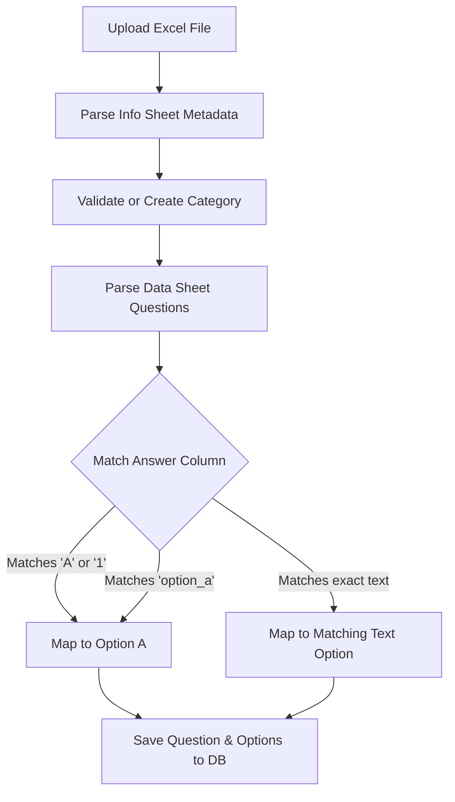

# QuizMind Data & Question Structure Guide

This document outlines the standard data models, spreadsheet formatting structures, and internal ingestion logic for Quiz collections, Individual Questions, and Spaced Repetition learning metrics in the QuizMind system.

---

## 1. Collection Metadata (Info Sheet)

When uploading custom content via an Excel template, the metadata defines the identity, theme, and AI behavior of the entire quiz set. These properties are specified as key-value pairs in the **'Info'** sheet.

| Metadata Key | Description | Data Type | Example |
| :--- | :--- | :--- | :--- |
| **Title** | The formal display name of the quiz collection. | String | JLPT N1 Vocabulary Master |
| **Description** | A detailed overview of what this collection covers. | Text | Comprehensive guide to N1 Kanji and vocabulary. |
| **Category** | Logical grouping to facilitate discovery (e.g., Languages, Science). | String | Japanese |
| **Tags** | Comma-separated list of keywords for index search. | String | jlpt, n1, vocabulary, japanese |
| **Time Limit** | Time allocated for the entire quiz in minutes (`0` = no limit). | Integer | 15 |
| **AI Prompt** | Specific system instructions for the Gemini engine when evaluating this quiz. | Text | Act as a strict Japanese sensei... |

---

## 2. Question Data Grid (Data Sheet)

Individual quiz items are defined in the tabular **'Data'** (or first) sheet of the spreadsheet. Each row represents a single question.

### Core Structure
| Column Header | Description | Required | Options / Default |
| :--- | :--- | :--- | :--- |
| **Question** | The main prompt, text, or query displayed to the user. | **Yes** | Text (supports Ruby `<ruby>` HTML tags for phonetics) |
| **Option_A** | Multiple choice option A. | **Yes** | Text |
| **Option_B** | Multiple choice option B. | **Yes** | Text |
| **Option_C** | Multiple choice option C. | No | Text |
| **Option_D** | Multiple choice option D. | No | Text |
| **Answer** | The designated correct option index or exact option text. | **Yes** | "A", "option_a", or exact option content string |
| **Explanation** | Static core logic or study guide regarding the correct answer. | No | Text |

### Rich Media & AI Ingestion
| Column Header | Description | Format |
| :--- | :--- | :--- |
| **Image** | Relative path to local asset or absolute public URL of a card image. | `https://...` or `image.jpg` |
| **Audio** | Relative path or URL to an audio clip for listening exercises. | `https://...` or `audio.mp3` |
| **AI_Explanation**| Custom pre-seeded AI analysis, bypassing the automated background engine. | Text / HTML |
| **Type** | The functional answer mechanism for this question. | Default: `"normal"` (maps to standard single-choice) |

### Custom Metadata Extension (`others` Ingestion)
> [!TIP]
> **Future-Proofing Schema**: Any additional columns found in the 'Data' sheet that do not match the core headers listed above are automatically ingested and parsed into a JSON object stored in the `others` column of the database. This allows creators to store rich structural properties like "Difficulty", "Source Book", "JLPT Level", or "Page Number".

---

## 3. Ingestion & Answer Mapping Logic

QuizMind utilizes a robust fuzzy-matching pipeline to translate spreadsheet rows into structured relational database schemas:



1. **Fuzzy Index Matching**: Maps strings like `"A"`, `"B"`, `"C"`, `"D"` or numbers `"1"`, `"2"`, `"3"`, `"4"`.
2. **Column Key Matching**: Recognizes programmatic option keys like `"option_a"`, `"option_b"`, etc.
3. **Exact Text Matching**: If the `Answer` cell matches the string literal of one of the defined options, it is marked correct.

---

## 4. Spaced Repetition & Mastery System (Leitner)

When a user submits an answer, the system updates a persistent learning record in the `UserQuestionMastery` table representing a **Leitner Spaced Repetition Box (Level 1 to 5)**.

```
[Box 1] ---> (Correct Answer x1) ---> [Box 2] ---> (Correct x2) ---> [Box 3] ---> (Correct x3) ---> [Box 4] ---> (Correct x4) ---> [Box 5 (Mastered)]
  ^                                                                                                                                   |
  +------------------------------------ (Any Incorrect Answer Resets Progress to Box 1) -----------------------------------------------+
```

- **Growth Rules**:
  - **Consecutive Correct**: The level increments as consecutive correct answers accumulate:
    - `consecutive_correct == 2` $\rightarrow$ **Box 2**
    - `consecutive_correct == 3` $\rightarrow$ **Box 3**
    - `consecutive_correct == 4` $\rightarrow$ **Box 4**
    - `consecutive_correct >= 5` $\rightarrow$ **Box 5** (Mastered)
  - **Failure Penalty**: Any incorrect submission instantly resets `consecutive_correct` to `0` and demotes the card back to **Box 1** for immediate re-learning.

---

## 5. Daily Goals & Streaks Ingestion

Every time a card is answered, progress is integrated with user-defined target goals in the scoring engine:

> [!IMPORTANT]
> **Unique Ingestion Rule**: To prevent grinding the same simple questions to exploit daily XP rewards, a question only counts toward the daily target if it is a **brand-new question** (i.e. never before answered by the user in any previous session for that specific quiz).

- **Daily Goal Reached**:
  - Unlocks **+50 Discipline XP** bonus.
  - Updates the `streak_count` (if completed on consecutive calendar days).
  - Sends immediate user notification toasts reporting remaining targets or limitless learning thresholds.

---

## 6. Database API Representation (JSON)

Programmatic requests to `/api/quiz/{quiz_id}/play-data` yield clean, standardized structures.

```json
{
  "id": 12,
  "title": "N1 Vocabulary Master",
  "description": "Essential JLPT N1 words.",
  "ai_prompt": "Act as a strict Japanese sensei...",
  "instruction": "Select the correct meaning of the underlined kanji.",
  "category_id": 2,
  "creator_id": 1,
  "is_collaborator": false,
  "user_total_xp": 1450,
  "questions": [
    {
      "id": 204,
      "content": "彼は常に<ruby>忖度<rt>そんたく</rt></ruby>して行動する。",
      "explanation": "忖度 (Sontaku): Đọc vị, phỏng đoán ý đồ/cảm xúc người khác.",
      "ai_explanation": "<p>Từ <strong>忖度</strong> gồm hai chữ Hán tự...</p>",
      "box_level": 3,
      "stats": {
        "total": 12,
        "correct": 9,
        "wrong": 3,
        "avg_time": 4.2
      },
      "options": [
        { "id": 810, "content": "Suy đoán cảm xúc", "is_correct": true },
        { "id": 811, "content": "Bỏ qua ý kiến", "is_correct": false }
      ]
    }
  ]
}
```
